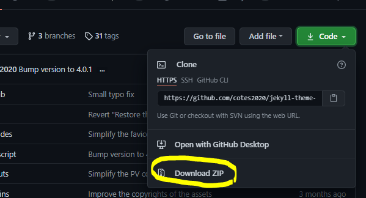

블로그를 만들기 위해 여러가지 플랫폼을 비교해보았지만 개발자라면 역시 깃허브 블로그라고 생각했다.
[http://jekyllthemes.org/](http://jekyllthemes.org) 에서 테마를 고르다가 chirpy 테마가 깔끔하기도 하고, 태그와 카테고리별로 글을 볼수 있어서 선택하였다.
오늘은 내가 블로그를 만들었던 과정에 대해서 적어볼 것 이다.
포스팅을 하면서 내가 했던 과정이나 실수등을 기록하며 다시한번 복기도 하고, 혹시 누군가게 도움이... 될수도 있지 않을까 해서 작성한다.

### Jekyll 블로그 생성하기

1. Git 설치 및 Clone

   - 먼저 Git설치를 위해 [https://git-scm.com/](https://git-scm.com/)에 접속하여 PC OS에 맞는 Git 버전을 다운로드 받아 설치한다
   - 이후 Git Bash 창에서 아래와 같이 본인의 계정을 등록한다.

     ```
     $ git config --global user.name "사용자"
     $ git config --global user.email "사용자 이메일"
     ```

   - 아래 그림에서 노란색 동그라미친 부분을 눌러 주소를 복사한 후 아래 적힌 명령어를 통해 블로그 Repository를 로컬로 복사한다. ( 붙여넣기 키는 shift + insert이다 )

     

     ```
     $ git clone 복사한 내용
     ```

   위와 같이 했다면 로컬 컴퓨터에 파일이 복사가 될 것 이다.

2. Ruby & Jekyll 설치
   - 나는 Window 유저이므로 window에 맞춰서 작성할 것 이다.
   - Ruby 설치
     https://rubyinstaller.org/downloads/ 에 접속하여 다운로드 한 후 next만 눌러서 설치를 완료한다.
     이후 `ruby -v` 명령어를 통해 설치되었는지 확인한다
   - Jekyll 설치
     Ruby의 gem 명령어를 통해 필요한 라이브러리를 설치한다.
   ```
   gem install bunder jekyll
   ```
3. 파일 다운로드
   - [http://jekyllthemes.org/](http://jekyllthemes.org)에서 원하는 테마를 선택한 다음 아래의 그림과 같이 download zip를 눌러 파일을 다운 받는다.
     
   - 이후 아까 clone 해놓은 파일에 다운로드 받은 zip 파일 압축을 해제한다.
4. 프로젝트 초기화
   - 이제 프로젝트 폴더로 이동하여 Initialization을 해준다
   ```
   $ bash tools/init.sh
   // .travis.yml, _posts, docs 파일을 삭제해준다.
   // github에 올리지 않을 것이라면 --no--gh 옵션을 사용하여 .github파일도 삭제해준다
   ```
   - github에 올리기 위해 `.github/workflows/pages-deploy.yml.hook`에서 `.hook` 확장자를 제거해줘 `.yml`파일로 만들어 주고 배포 파일을 제외하고 다 삭제해준다.
5. 설정 파일
   - \_config 파일에서 몇가지를 수정해준다.
   ```
   title: 블로그 제목
   tagline: 블로그 밑에 작은 subtitle?
   url: github page 레포 url ex) https://joojaewoo.github.io
   avator: 대표 사진으로 쓰일 이미지, 일반적으로 사진은 assets의 img폴더에 넣고 불러와서 사용한다 ex) /assets/img/profile.jpg
   timezone: Asia/Seoul
   ```
6. 로컬 테스트
   - 배포하기전 로컬에서 테스트를 해본다.
   - 아래와 같은 명령어를 입력하고 `http://localhost:4000` 에 접속해서 확인할 수 있다.
   ```
   bundle install
   bundle exec jekyll serve
   ```
7. 깃허브 배포
   - 테스트 완료된 파일을 `origin/master`에 push 하면 git action에 의해서 `pages-deploy.yml` 이 실행된다. 빌드가 성공적으로 되었다면 `gh-pages` 브랜치가 생성된 것을 볼 수 있다.
   - `setting`의 `pages`메뉴에서 `gh-pages`브랜치로 변경해주면 배포가 완료된다.

이제 \_posts 폴더내부에 마크다운 방식으로 작성하여 push하면 블로그에 포스팅 된다.

끝!!
